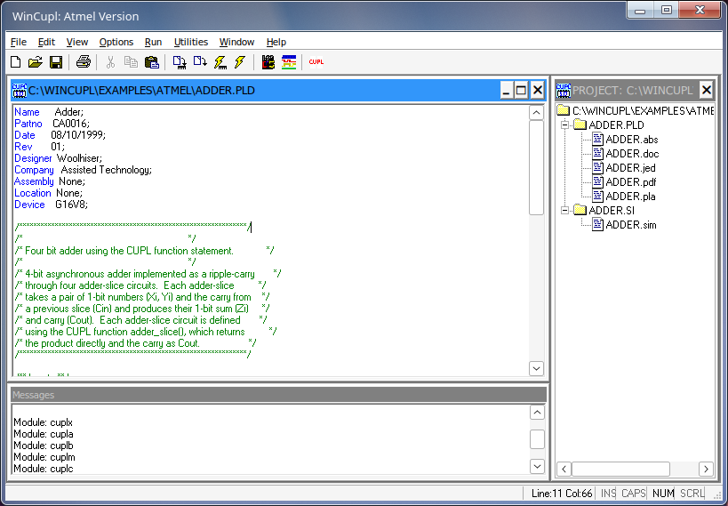

# WinCUPL on MX Linux

Installs **Atmel WinCUPL 5.30.4** — the classic version — under Wine, with a
menu entry, desktop icon and the program's own icon.

## Why this exists

WinCUPL is a Visual Basic 6 program from 2014, and Wine ships none of the
pieces it depends on. Installed by hand it fails five times over, each one
only appearing once the previous is satisfied, and the first two say nothing
at all:

| what happens | what is missing |
|---|---|
| double-click does nothing, no window, no error | `MSVBVM60.DLL` — the VB6 runtime |
| "runtime error 339" | `COMCTL32.OCX` |
| same error opening any file | `COMDLG32.OCX` |
| "Dwsbc32.ocx missing" | `DWSBC32.OCX`, plus `DWSPY32.DLL` and `MFC40.DLL` before it will even register |
| a `.PLD` opens into nothing; no Edit/Run/Utilities menus | `RICHTX32.OCX` — the editor control — and `TABCTL32.OCX`, `Comct232.ocx` |
| "Unable to read environment variable: LIBCUPL" | the compiler's library path |

The control list was not found by clicking until it stopped complaining: it
came from reading the controls named inside `Wincupl.exe`, which lists all six
at once.

**The VB6 runtime does not include these.** It is only the language runtime —
the virtual machine that executes VB6 P-code. The controls shipped separately
with Visual Studio 6 and were licensed individually, so each application's
installer carried the ones it used. `DWSBC32.OCX` is not Microsoft's at all;
it is a third-party Desaware control.

## Two things that are not obvious

**It needs a 64-bit Wine prefix.** WinCUPL is a 32-bit program, so a `win32`
prefix looks like the obvious choice. Built that way the process starts, sits
idle at 0% CPU and never draws a window. In a 64-bit prefix the 32-bit
runtimes land in `syswow64` and WoW64 runs it perfectly.

**`LIBCUPL` must name the library file**, `...\Shared\cupl.dl`, not the folder
holding it. Pointed at the folder, the compiler fails with
`could not open: C:\Wincupl\Shared`, which reads like a permissions problem
and is not one.

## Usage

    ./wincupl-install.sh install            # uses the bundled copy
    ./wincupl-install.sh install /path/to/Wincupl   # or one of your own
    ./wincupl-install.sh uninstall

    ORGANIZATION="Your Name" ./wincupl-install.sh install

It is self-contained: everything it needs ships beside it, nothing is read
from a Windows partition, and it installs into its own Wine prefix at
`~/.wine-wincupl` so it cannot disturb anything else.

## Registration

WinCUPL asks for an organisation and a serial number on first run. The serial
is free and published by Microchip: **60008009**. The installer writes it in,
so it never asks. It lives in the registry under the name of the company that
wrote CUPL before Atmel bought them:

    HKCU\Software\Logical Devices\WinCupl\5.0\Settings
        Organization, SerialNo

## What is bundled, and where it came from

* `wincupl-files/` — WinCUPL 5.30.4, from Microchip's own download:
  <https://ww1.microchip.com/downloads/en/DeviceDoc/awincupl.exe.zip>
  (linked from <https://www.microchip.com/en-us/development-tool/wincupl>).
  It is bundled rather than downloaded so this keeps working if that URL moves,
  as Winamp's did.
* `deps/` — `DWSBC32.OCX`, `DWSPY32.DLL`, `MFC40.DLL`, `COMCT232.OCX`. These
  came with a Windows installation and are not in winetricks. Everything else
  Microsoft ships is fetched by winetricks at install time rather than kept
  here.
* `wincupl.png` — the CUPL logo, extracted from `Wincupl.exe`.

## There is also a WinCUPL II

Microchip released **WinCUPL II v1.1.0** in February 2026 — a .NET rewrite for
Windows 10/11, free, no serial, and it runs under Wine with no shims at all.
It is a completely different interface. This installer is for people who want
the program they know.

## Tested on

MX Linux 23 (KDE), Wine 9.21.
